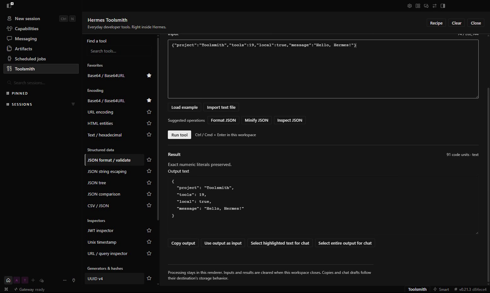

<div align="center">

<a href="https://github.com/NousResearch/hermes-agent">
  
</a>

# Toolsmith

**Everyday developer tools. Right inside Hermes.**

Format JSON, decode a payload, compare text, or chain conversions together. Nineteen tool families in one native Hermes Desktop page. Your input stays local until you choose to copy or share it.

<sub>POWERED BY <a href="https://github.com/NousResearch/hermes-agent">HERMES AGENT</a> &nbsp;·&nbsp; COMMUNITY PLUGIN &nbsp;·&nbsp; VERSION 1.0.0</sub>

<br /><br />

[See what it does](#small-jobs-without-leaving-hermes) &nbsp;·&nbsp; [Watch the demo](https://github.com/Adolanium/hermes-toolsmith/releases/download/v1.0.0/Toolsmith-demo-with-mouse.mp4) &nbsp;·&nbsp; [Install](#install) &nbsp;·&nbsp; [All tools](#nineteen-tool-families)

</div>



## Powered by Hermes

Toolsmith opens straight from the Hermes sidebar and follows your Desktop theme. It uses the native plugin SDK for controls, menus, and the chat handoff. One bundled file. No API key, extra server, or model call.

## Small jobs without leaving Hermes

|                                                                                                                                                               |                                                                                                                                                                  |
| ------------------------------------------------------------------------------------------------------------------------------------------------------------- | ---------------------------------------------------------------------------------------------------------------------------------------------------------------- |
| **Make sense of a payload**<br />Format JSON without rounding large numbers. Expand a JSON tree, inspect a JWT, or pull apart a URL and its query parameters. | **Convert what you have**<br />Base64, hex, URL encoding, HTML entities, CSV, timestamps, number bases, and colors. Load a small UTF-8 file or paste your input. |
| **Run the whole sequence**<br />Chain up to 12 conversions into a recipe. Reorder steps, inspect intermediate results, and save the definition for next time. | **Take only what you need to chat**<br />Select a result, review the exact text, then insert it into a draft. Nothing is sent automatically.                     |

Search the tool list, star your regulars, and run with **Ctrl/Cmd+Enter**. Suggestions offer likely operations for your input; you choose what runs. Switching tools keeps the original input, and **Use output as input** makes replacement explicit.

## One recipe, three steps

An encoded response does not have to mean three different websites.

```text
URL decode → Base64 decode → Format JSON
```

Open **Recipe**, click **Load demo and example input**, then **Run recipe**. You get the decoded JSON and an expandable result for every step. Save the recipe to reuse its settings, or copy its definition to share it. Inputs and results are not included in saved definitions.

## Nineteen tool families

| Group                 | Tools                                                                                    |
| --------------------- | ---------------------------------------------------------------------------------------- |
| Encoding              | Base64 / Base64URL · URL encoding · HTML entities · Text / hexadecimal                   |
| Structured data       | JSON format / validate · JSON string escaping · JSON tree · JSON comparison · CSV / JSON |
| Inspectors            | JWT inspector · Unix timestamp · URL / query inspector                                   |
| Generators and hashes | UUID v4 · Random strings / passwords · SHA-256 / SHA-512                                 |
| Text and conversions  | Text utilities · Text diff · Number bases · Color conversion                             |

JWT inspection decodes the token; it does not verify its signature. CSV imports preserve cells as strings. Input and output limits keep larger jobs from overwhelming the page. See the [tool reference](docs/reference.md) for exact behavior and limits.

## Install

Use a current Hermes Desktop with combined-package support. The native demo was recorded on Windows with Desktop 0.21.3.

### From GitHub

Run on the machine where Desktop is installed:

```sh
hermes plugins install Adolanium/hermes-toolsmith
hermes plugins enable hermes-toolsmith
```

Restart Desktop or run **Reload desktop plugins**, then enable **Hermes Toolsmith** in **Capabilities → Plugins**. Click **Toolsmith** in the sidebar. You can also use **Toolsmith: Open** in the command palette.

### Just the Desktop file

Download [`plugin.js`](https://github.com/Adolanium/hermes-toolsmith/releases/download/v1.0.0/plugin.js) and place it in:

```text
$HERMES_HOME/desktop-plugins/hermes-toolsmith/plugin.js
```

With the usual defaults, that is `~/.hermes/desktop-plugins/hermes-toolsmith/` on macOS/Linux, or `%LOCALAPPDATA%\hermes\desktop-plugins\hermes-toolsmith\` on Windows. Use your configured Hermes home if it differs. No Node.js or build step is needed.

Choose one installation method. Hermes preserves manually installed plugin folders, so an existing manual copy can take precedence over a package install.

## From a result to a draft

1. Select the entire output, a highlighted part, a tree value, or a recipe result using its **Select … for chat** button.
2. Switch to a chat and open **Add context → Toolsmith: insert reviewed output**.
3. Review or edit the preview, then click **Insert into draft**.

The handoff needs Hermes's status bar to be visible. Use **Toggle status bar** in the command palette if it is hidden. **Copy output** is always available. Drafts and clipboard contents follow their destination's storage behavior.

## Local by default

Conversions run in the Desktop renderer. Toolsmith makes no network requests and does not read your clipboard in the background. It saves favorites, the selected tool, and recipe definitions. Input, output, and intermediate results stay in memory while you work. Switching pages keeps them; **Clear**, **Close**, or disabling the plugin releases them.

## Updates and development

Toolsmith does not replace its own files. Repository installs update through Hermes; manual installs update by replacing `plugin.js` with a release file. Catalog installs, once admitted, use reviewed commit pins and `hermes plugins update hermes-toolsmith`.

To work on the plugin, use Node.js 22 or newer:

```sh
npm ci
npx playwright install chromium
npm run check
npm run format:check
```

The build produces the single committed artifact at `desktop/plugin.js`. Source lives in `src/`; tests and build scripts stay in `tests/` and `scripts/`. Browser tests exercise the built artifact with a mock SDK. The demo shows the real Desktop app. The small Python entry point exists for Hermes package discovery and registers no Agent tools or hooks.

## License

[MIT](LICENSE). Bundled dependency notices are in [THIRD_PARTY_NOTICES.md](THIRD_PARTY_NOTICES.md).

---

<div align="center">

**Toolsmith**<br />
<sub>Keep the small jobs inside Hermes.</sub>

</div>

> **Community project**<br />
> Toolsmith is an independent community plugin. It is not affiliated with or endorsed by Nous Research or the Hermes Agent project. Their names and marks belong to their respective owners.
